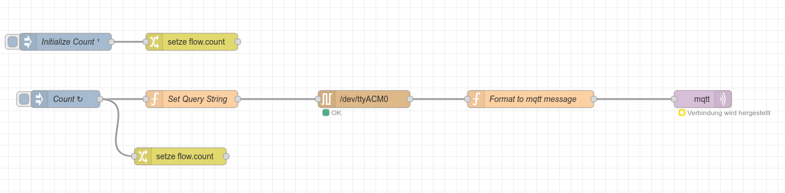

# Aufgabe node-red, telegraf und influx db

[Lösungen der Aufgaben](report.md)


Da mir die VM zu und zu unflexibel ist habe ich den Stack mit Docker aufgesetzt. Die Messdaten aus dem TCLab sollten in die influxdb geschriben werden und folgenden Weg gehen:


TCLab => node-red => MQTT => telegraf => influxdb


Das TCLab stellt einen seriellen Port zur Verfügung um die Daten auszulesen. Unter Linux müssen erstmal die Rechte freigegeben werden. Damit das gelingt, müssen wir eine udev rule anlegen:

```
KERNEL=="ttyUSB[0-9]*", ATTRS{idVendor}=="0403", ATTRS{idProduct}=="6001",  MODE="0666"
KERNEL=="ttyACM[0-9]*", ATTRS{idVendor}=="0403", ATTRS{idProduct}=="6001",  MODE="0666"
```

Damit haben wir den seriellen Port für alle Nutzer freigegeben und das Sicherheitssystem von Linux außer Kraft gesetzt. Da unter Linux jedes Gerät eine Datei ist, sollte es eigentlich möglich sein, diese in den Container zu mounten. Dies ist leider nicht gelungen. Als Abhilfe können wir den Port aber als Device übergeben. In der [docker-compose datei](docker-compose.yml#L68) ist das diese Zeile:
```yaml
devices:
    - "/dev/ttyACM0:/dev/ttyACM0"
```

Mit diesem Eintrag können wir einen node red flow aufsetzen, der periodisch die Temperatursensoren und die Solltemperatur des Reglers abfragt und als MQTT published.




Der Code im `Set Query` node sieht folgendermaßen aus:
```js
const messages = [
    "T1",
    "T2",
    "R1",
    "R2",
]

let index = flow.get("count") % messages.length

msg.payload = messages[index]
return msg;
``` 

Der komplette Flow ist [hier](node-red_flow.json)  abgelegt. Wir konfigurieren zusätzlich einen telegraf Service, der sich auf das Mqtttopic registriert (_subscribe_), transformiert und in die influxdb speichert. Die Wahl von telegraf hat Vor- und Nachteile. Der Vorteil ist, dass die Transformation ohne Programierkenntnisse möglich ist und neue Signale sehr schnell hinzugefügt werden können. Ein weiterer Vorteil ist, das telegraf und docker ein Match made in heaven ist, da telegraf sehr einfach die Metriken des docker hosts abfragen und in telegraf speichern kann, so dass wir das System-Monitoring geschenkt bekommen. 

Der Nachteil ist die eher umständliche Konfiguration und die schlechte Debuggbarkeit zur Fehlersuche. Die Konfiguration limitiert außerdem die Transformationsmöglichkeiten.


Die `docker-compose` Dile erwartet eine `enviroment.env` Datei mit geheimen Informationen die folgende Struktur haben muss:
```
DOCKER_INFLUXDB_INIT_MODE=setup
DOCKER_INFLUXDB_INIT_USERNAME=
DOCKER_INFLUXDB_INIT_PASSWORD=
DOCKER_INFLUXDB_INIT_ORG=
DOCKER_INFLUXDB_INIT_BUCKET=
DOCKER_INFLUXDB_INIT_ADMIN_TOKEN=

INFLUXDB_DB=
INFLUXDB_ADMIN_USER=
INFLUXDB_ADMIN_PASSWORD=
```
