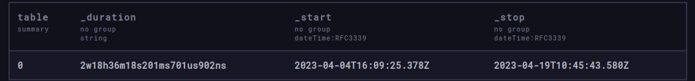
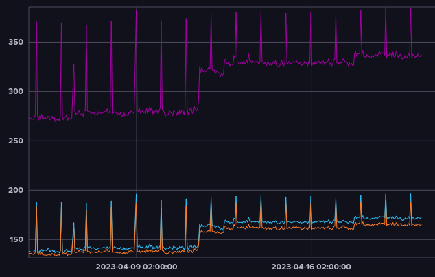
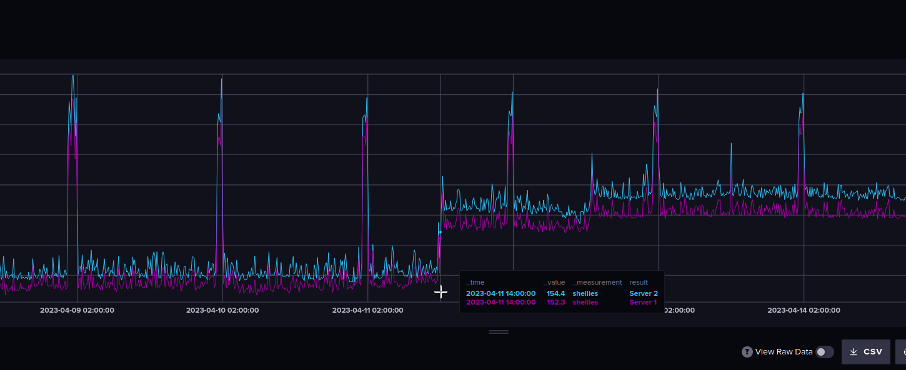
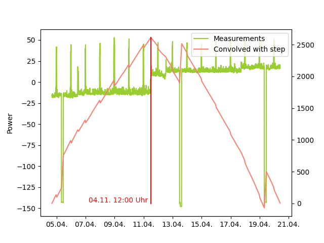
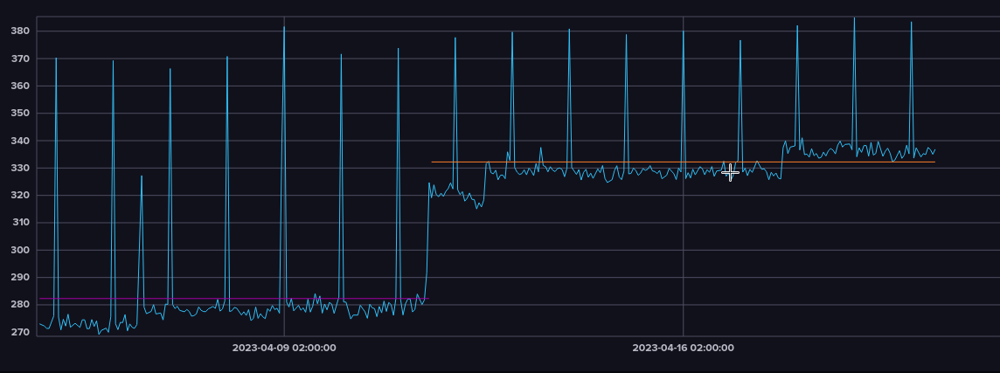
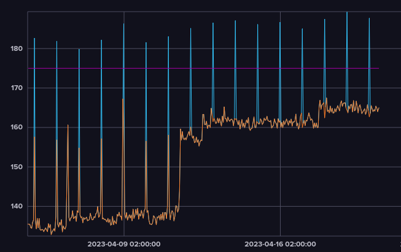

# Aufgaben Influx


## Stromdaten (measurement „shellies“)

### In welchem Zeitraum wurden liegen die Daten vor?

Der erste Record hat den Timestamp `2023-04-04T16:09:25.378Z`, der Zweite `2023-04-19T10:45:43.580Z`. Dies entspricht einer Zeitspanne von 2 Wochen und 18 Stunden.




```
import "join"

range = from(bucket: "AdlerTasks")
  |> range(start: -1, stop: now())
  |> filter(fn: (r) => r["_measurement"] == "shellies")
  |> filter(fn: (r) => r["_field"] == "value")
  |> keep(columns: ["_time", "_value", "_measurement"])

join.full(
    left: range |> first(),
    right: range |> last(),
    on: (l, r) => l._measurement == r._measurement, 
    as: (l, r) => {
        start = uint(v: l._time)
        stop = uint(v: r._time)

        return {
           _time: l._time,
           _measurement : l._measurement, 
           _start: l._time,
           _stop: r._time,
           // Flux does not support duration column types.
           // To store durations in a column, convert duration types to strings.
           _duration: string(v:  duration(v: stop -start)) 
         }
    },)
  |> keep(columns: ["_start", "_stop", "_duration"])
  |> yield(name: "summary")
```


### Wieviel Strom wurde je Stunde benötigt?


```
from(bucket: "AdlerTasks")
  |> range(start: v.timeRangeStart, stop: v.timeRangeStop)
  |> filter(fn: (r) => r["_measurement"] == "shellies")
  |> filter(fn: (r) => r["Sensor"] == "power")
  |> filter(fn: (r) => r["_field"] == "value")
  |> aggregateWindow(every: 1h, fn: mean, createEmpty: false)
  |> yield(name: "Power pro hour")
```


### Der Server verwendet 2 Netzteile – summieren Sie beide Kennlinien zum Gesamtstromverbrauch (Device server1 und server2)



```
import "join"

data = from(bucket: "AdlerTasks")
  |> range(start: 0, stop: now())
  |> filter(fn: (r) => r["_measurement"] == "shellies" and r["Sensor"] == "power")
  |> aggregateWindow(every: 1h, fn: mean, createEmpty: false)
  |> group(columns: ["_measurement"])

server1 = data  |> filter(fn: (r) => r["Device"] == "server1")
server2 = data  |> filter(fn: (r) => r["Device"] == "server2")

server1 |> yield(name: "Server 1")
server2 |> yield(name: "Server 2")

join.time(
    left: server1, 
    right: server2, 
    as: (l,r)=>({l with _value: l["_value"] + r["_value"]}))
|> yield(name: "total")
```


### Im Server wurde irgendwann eine Grafikkarte in einen virtuellen Server eingebunden, wodurch der Stromverbrauch angestiegen ist
#### Wann war dieser Wechsel? (ablesen)
Der Einbau der Grafikkarte erfolge am 11. April um ca. 14:00 Uhr.



Mit flux Mitteln war es mir nicht möglich, den Zeitpunkt analytisch herauszufinden. Allerdings ist es mit numpy möglich, den Stromverbrauch mit einer Stepfunktion zu falten und den maximalen Ausschlag zu identifizieren

```python
df = read_shellies()
data = df["value"].to_numpy()

data -= np.average(data)
step = np.hstack((np.ones(len(data)), -1 * np.ones(len(data))))

data_step = np.convolve(data, step, mode='valid')
step_index= np.argmax(data_step)

step_time = df["_time"].loc[step_index]
```
Plot:




#### Wie hoch war der ungefähre mittlere Verbrauch vor und nach diesem Ereignis?

Der Verbrauch vor dem Einbau der Karte war durchschnittlich 282.3 Watt. Nach dem Umbau erhöhte er sich auf 332.22 Watt.



```
import "join"


data = from(bucket: "AdlerTasks")
  |> range(start: 0, stop: now())
  |> filter(fn: (r) => r["_measurement"] == "shellies" and r["Sensor"] == "power")
  |> aggregateWindow(every: 1h, fn: mean, createEmpty: false)
  |> group(columns: ["_measurement"])

graficsReplacement = time(v: "2023-04-11T14:00:00.000000000Z")

total = join.time(
    left:  data |> filter(fn: (r) => r["Device"] == "server1"), 
    right: data |> filter(fn: (r) => r["Device"] == "server2"), 
    as: (l,r)=>({l with _value: l["_value"] + r["_value"]}))
|> map(fn: (r)=>({r with beforeReplacement: if r["_time"] < graficsReplacement then true else false }))        


total
    |> yield(name: "total")


meanBefore = total 
|> filter(fn: (r) => r["beforeReplacement"] == true)
|> mean()
|> findColumn(
    fn: (key) => true,
    column: "_value",
)

 total 
  |> filter(fn: (r) => r["beforeReplacement"] == true)
  |> map(fn: (r) => ({r with _value: meanBefore[0] }))
  |> yield(name: "beforeReplacement")


meanAfter = total 
|> filter(fn: (r) => r["beforeReplacement"] == false)
|> mean()
|> findColumn(
    fn: (key) => true,
    column: "_value",
)
 total 
  |> filter(fn: (r) => r["beforeReplacement"] == false)
  |> map(fn: (r) => ({r with _value: meanAfter[0] }))
  |> yield(name: "afterReplacement")

```


#### Ausreißer Server 1



```
data  =  from(bucket: "AdlerTasks")
  |> range(start: 0, stop: now())
  |> filter(fn: (r) => r["_measurement"] == "shellies" and r["Sensor"] == "power")
  |> aggregateWindow(every: 1h, fn: mean, createEmpty: false)
  |> group(columns: ["_measurement"])


outlierThreshhold = float(v: 175)
outlierCorrection = float(v: -25)

server1 = data |> filter(fn: (r) => r["Device"] == "server1")
    |> yield(name: "no outlier corrected")

server1 
    // if r["_time"] < graficsReplacement then true else false 
    |> map(fn: (r)=>({r with _value: outlierThreshhold }))
    |> yield(name: "outlier threshhold")

server1 
    // if r["_time"] < graficsReplacement then true else false 
    |> map(fn: (r)=>({r with _value: if r["_value"] < outlierThreshhold then r["_value"] else r["_value"] + outlierCorrection }))
    |> yield(name: "outlier corrected")
```